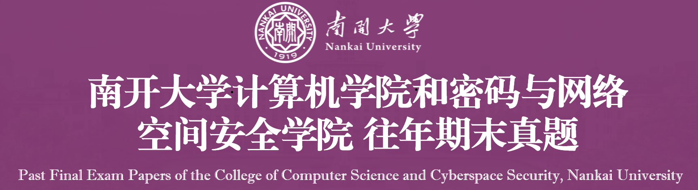

  
  <h3>南开大学计算机学院和网络空间安全学院往年期末真题</h3>

  
  
  
  
  
  
  
  

## Star History

## 前言
首先，此仓库单纯是为了分享复习资料，本人水平一般，对于仓库中的部分内容请自行甄别。若发现了明显的错误，请联系我进行修改；另外，有关于本人github中其他仓库的代码或者实验报告，不保证高分，不保证正确，请自行甄别。一般来说我会标明本人的实验大致得分情况。

时间过得很快，一眨眼，在大学就已经度过了两年半的时光，经历了五个学期期末周的压力，我也算是基本结束了大学期间的考试任务。在搜集各类学习资料、往年真题时，我深感资源之难寻、内容质量良莠不齐等各方面的问题，因此为了让学弟学妹们能够共享资源、消除部分信息差，我开设了这个库，里面存放了许多备考过程中用的到的复习资料和往年真题。在此，特别感谢2021级信息安全专业的[lxmliu2002](https://github.com/lxmliu2002)和2020级计算机科学与技术专业的[NKULYX](https://github.com/NKULYX)这两位学长，提供了我在备考期间的绝大部分资料，也感谢其他的一些学长学姐免费提供的一些有用的资料，由于篇幅问题此处就不再提及了

## 库里面有什么？
库里面包含了绝大部分市面上(或者说往年的学长学姐的回忆版)出现过的任何形式的复习资料或者往年真题，根据课程名称来进行分类存放，通过课程名称即可查询到相关的学习资料

### 大一上
+ 高等数学A类I
+ 线性代数
+ 高级语言程序设计2-1
+ 思想道德与法治
### 大一下
+ 大学物理学
+ 电路基础
+ 高等数学A类II
+ 高级语言程序设计2-2
+ 马克思主义原理
### 大二上
+ 数据结构
+ 数字逻辑
+ 概率论与数理统计
+ 汇编语言与逆向技术
+ 中国近现代史纲要
+ 大学语文
### 大二下
+ 人工智能导论
+ 嵌入式系统
+ 毛概
+ 软件安全
+ 计算机组成原理
+ 数据库系统
+ 信息安全数学基础
### 大三上
+ 密码学
+ 恶意代码分析与防治技术
+ 习概
+ 区块链基础及应用
+ 计算机网络
+ 操作系统
+ 编译系统原理

## 一些规定
+ 首先，该库免费和大家一起共享，本身就是开源项目，旨在消除信息差，任何人不得以任何形式，将此库中的内容打包进行出售，违者必究！！！
+ 其次，若有疑问，请飞书&微信联系我，请不要提交issue，更不要随意提交requests
+ 如果有**新的往年真题**，可以通过飞书与我联系，或者向我提交合并请求，都可以
